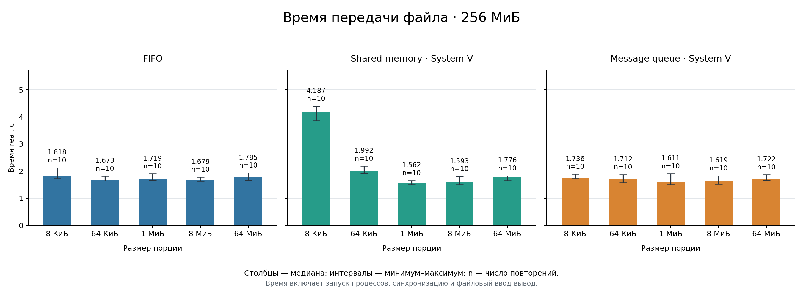

# Измерение скорости передачи 
Измерялась скорость передачи файла из одного процесса в другой при помощи различных ipc таких, как SYS V sharedMemory, SYS V queue, FIFO.

# Запуск бенчмарка 
```sh
# увеличим максимальный размер очереди и сообщения в ней  
sudo sysctl -w kernel.msgmax=2097152
sudo sysctl -w kernel.msgmnb=8388608
```

Непосредственно запуск:
```sh
# увеличим максимальный размер очереди и сообщения в ней. [аргумент] - аргумент не обязателен   
./runBenchmark.sh [кол-во повторений измерений] [размер файла]
```

# Результаты
При помощи набора скриптов выполняются измерения и сохраняются в папке [benchmark](benchmark/).
Основной интерес представляет сгенерированная диаграмма по результатам измерений:

<p align="center">
  
</p>


